# FinanceLens AI — Code Documentation & Design

## Part 1: Code Overview & Application Flow

### 1.1 What This App Does

FinanceLens AI is a 100% offline personal finance app for iPhone. It tracks spending, categorizes transactions using AI, detects subscriptions, forecasts expenses, and lets users chat with their financial data — all without any internet connection.

### 1.2 Code Organization

| Folder | Purpose | Key Files |
|--------|---------|-----------|
| `App/` | Entry point & global state | `FinanceLensApp.swift`, `AppState.swift` |
| `Core/Navigation/` | App routing | `AppCoordinator.swift`, `MainTabView.swift` |
| `Core/Security/` | Auth & encryption | `BiometricAuthManager.swift`, `PINManager.swift`, `KeychainManager.swift` |
| `Domain/Models/` | SwiftData entities | `Transaction.swift`, `Budget.swift`, `Category.swift`, etc. |
| `Domain/Repositories/` | Data access layer | `TransactionRepository.swift`, `BudgetRepository.swift` |
| `Domain/Services/` | Business logic engines | 9 service modules |
| `Features/` | UI screens (MVVM) | Views + ViewModels per feature |
| `Resources/` | Sample data & ML models | `SampleDataGenerator.swift`, `sample_statement.csv` |

### 1.3 Application Flow

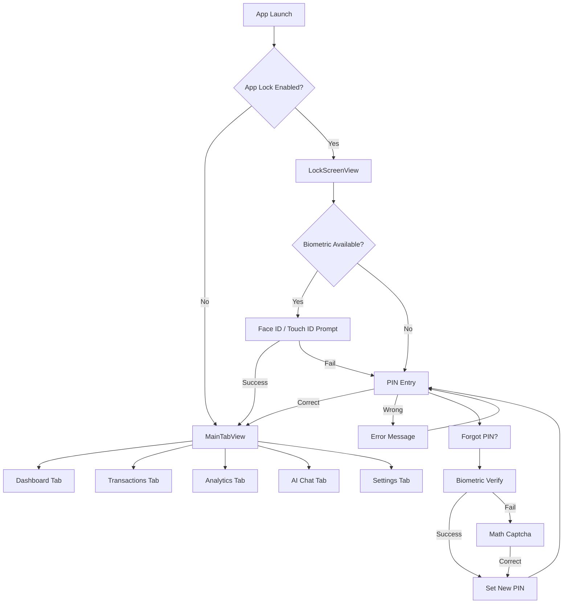

### 1.4 Transaction Lifecycle Flow

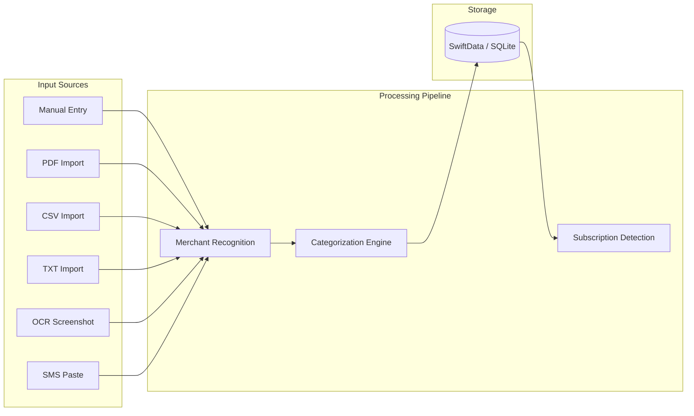

### 1.5 How Each File Works

#### App Layer

**`FinanceLensApp.swift`** — The `@main` entry point. Creates a `ModelContainer` with all SwiftData schemas, injects it into the view hierarchy via `.modelContainer()`.

**`AppState.swift`** — An `ObservableObject` holding `isUnlocked` and `isFirstLaunch`. Controls whether the app shows the lock screen or main content.

#### Navigation Layer

**`AppCoordinator.swift`** — Reads `appLockEnabled` from `@AppStorage`. If lock is on and app isn't unlocked, shows `LockScreenView`; otherwise shows `MainTabView`.

**`MainTabView.swift`** — 5-tab `TabView`: Dashboard, Transactions, Analytics, AI Chat, Settings.

#### Security Layer

**`BiometricAuthManager.swift`** — Wraps `LAContext`. Calls `checkAvailability()` once on appear (not during render to avoid UI blocking). `authenticate()` is async, creates a fresh `LAContext` per call.

**`PINManager.swift`** — Static methods: `setPin()` hashes with SHA256 and stores in Keychain; `verifyPin()` compares hashes; `hasPin()` checks existence.

**`KeychainManager.swift`** — Generic Keychain wrapper with `save/get/delete` for string values. Uses `kSecAttrAccessibleWhenUnlockedThisDeviceOnly`.

#### Domain Models

**`Transaction.swift`** — Core entity: amount, merchant, normalizedMerchant, categoryName, date, type, paymentMethod, notes, confidence, source. Has relationships to Category, Merchant, Subscription.

**`Category.swift`** — 17 default categories with name, icon (SF Symbol), color (hex), and keyword arrays for auto-categorization.

**`Budget.swift`** — Monthly category budgets with spent tracking, utilization calculation, and alert flags at 50/80/100%.

**`Subscription.swift`** — Detected recurring payments with frequency enum, monthly equivalent calculation, and next due date.

#### Repository Layer

**`TransactionRepository.swift`** — CRUD + query methods: `fetchAll` (with optional date/category/merchant/type filters), `totalSpending`, `totalIncome`, `spendingByCategory`, `topMerchants`.

**`BudgetRepository.swift`** — CRUD for budgets, filtered by month/year. `updateSpent()` syncs actual spending from transactions.

#### Service Engines

Each engine is a pure logic class with no UI dependencies:

| Engine | Input | Output |
|--------|-------|--------|
| `PDFStatementParser` | PDF Data | `[ParsedTransaction]` |
| `CSVStatementParser` | CSV Data | `[ParsedTransaction]` |
| `OCREngine` | UIImage | `[OCRResult]` |
| `SMSParserEngine` | String (SMS text) | `ParsedSMS` |
| `CategorizationEngine` | merchant + description | `CategorizationResult` (category, confidence, method) |
| `MerchantRecognitionEngine` | raw merchant string | normalized name |
| `SubscriptionDetectionEngine` | `[Transaction]` | `[DetectedSubscription]` |
| `AnalyticsEngine` | date range | spending/category/merchant/cashflow analytics |
| `FinancialHealthEngine` | all data | score 0-100 with breakdown |
| `ForecastingEngine` | historical values | predicted amounts with confidence |
| `FinancialChatEngine` | user query | structured response with sources |

---

## Part 2: Data Flow Diagrams

### 2.1 Statement Import Data Flow

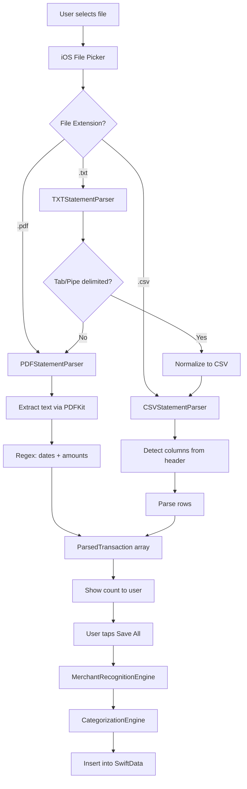

### 2.2 Categorization Data Flow

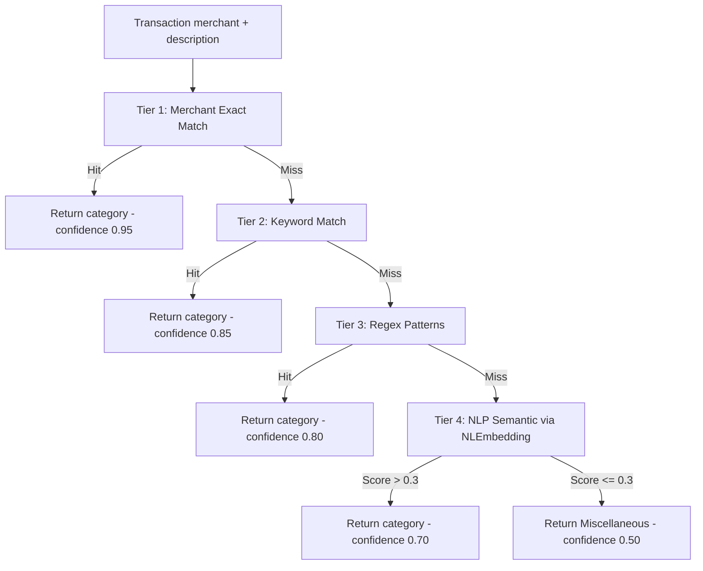

### 2.3 AI Chat Data Flow

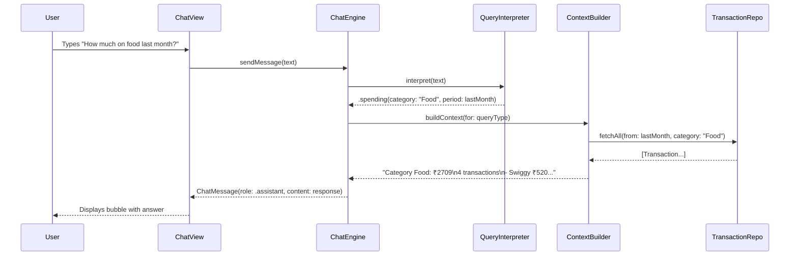

### 2.4 Subscription Detection Data Flow

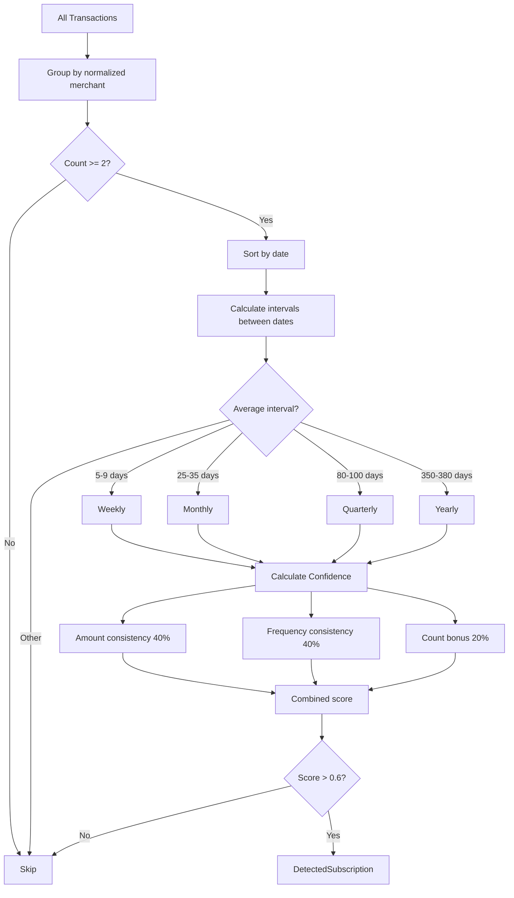

### 2.5 Budget Alert Data Flow

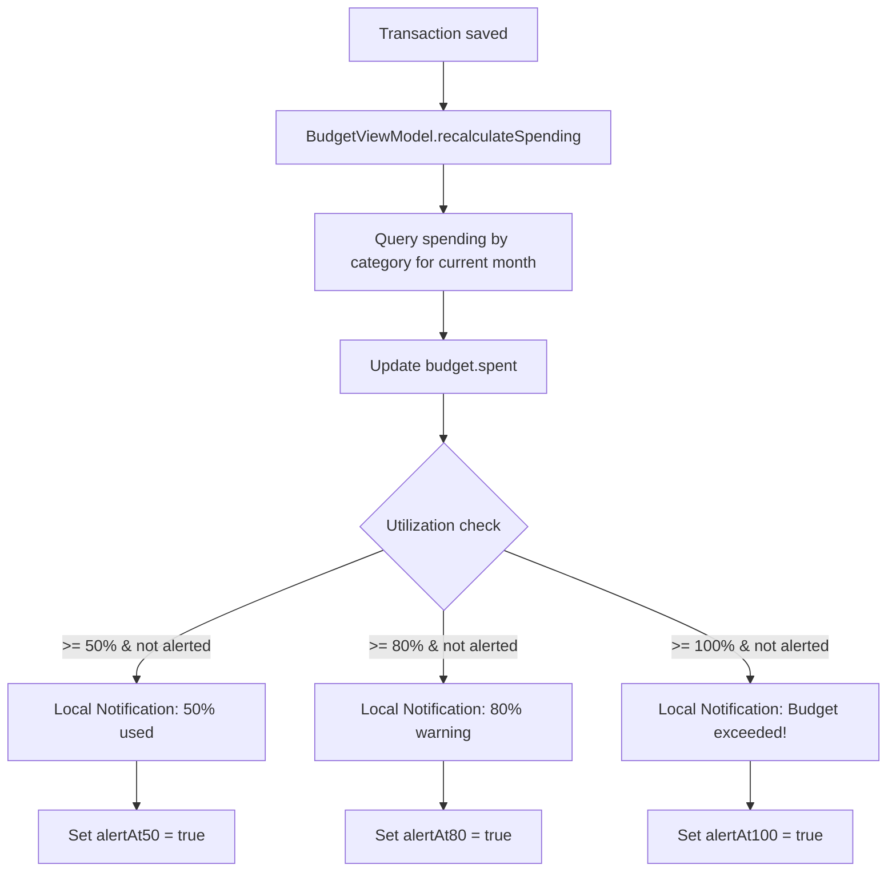

### 2.6 SMS Parse Data Flow

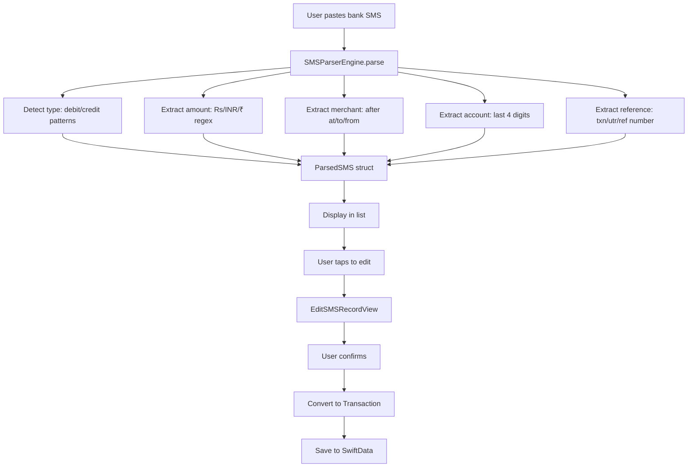

---

## Part 3: High Level Design (HLD)

### 3.1 System Context

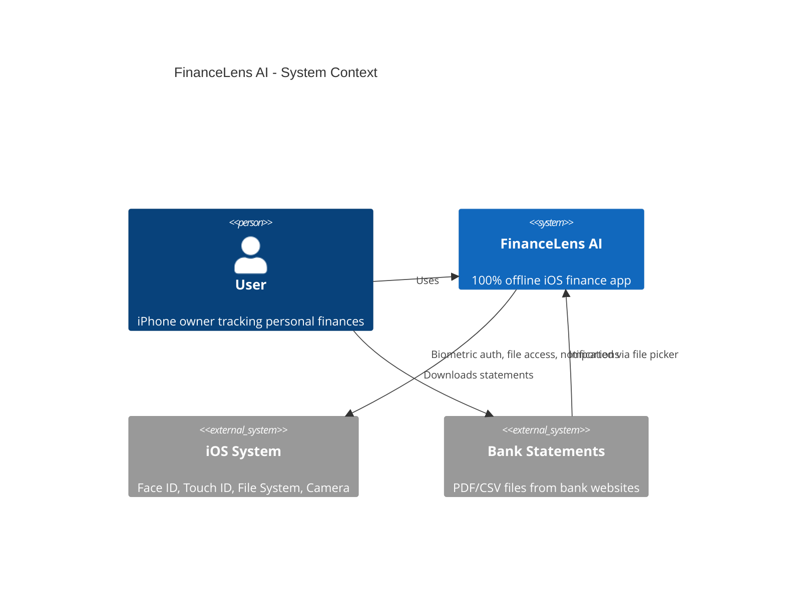

### 3.2 High-Level Component Architecture

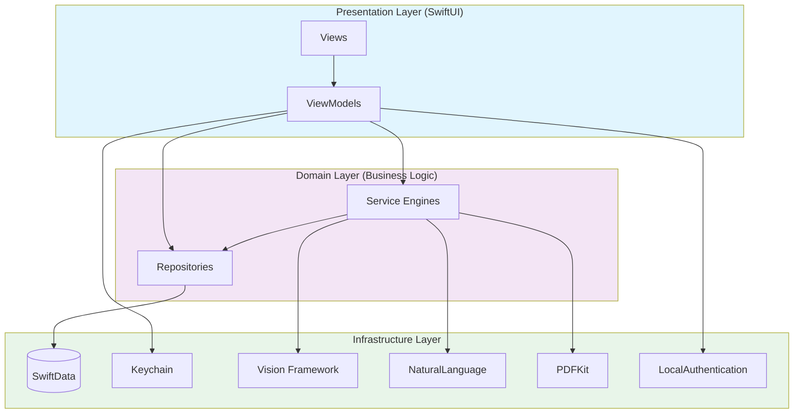

### 3.3 Module Dependency Diagram

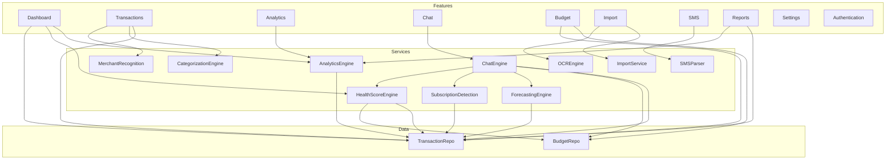

### 3.4 Technology Decisions

| Decision | Choice | Rationale |
|----------|--------|-----------|
| Storage | SwiftData | Native Apple ORM, no dependencies, type-safe |
| AI/NLP | NaturalLanguage framework | On-device embeddings, no cloud |
| OCR | Vision framework | System-level accuracy, offline |
| PDF | PDFKit | Built-in, handles all PDF versions |
| Auth | LocalAuthentication | Secure Enclave integration |
| Charts | Swift Charts | Native, declarative, iOS 16+ |
| Secrets | Keychain Services | Hardware-backed, survives reinstalls |
| Architecture | MVVM + Repository | Testable, separation of concerns |
| Navigation | Coordinator + TabView | Centralized routing logic |
| Concurrency | async/await | Modern Swift concurrency |

### 3.5 Security Architecture

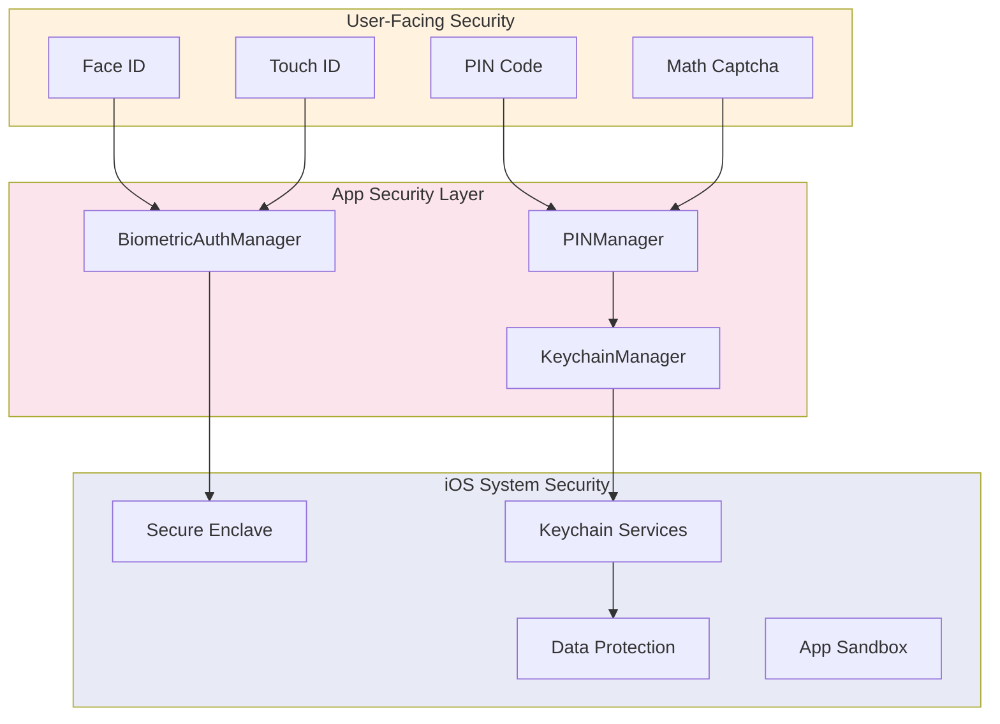

### 3.6 Offline Guarantee

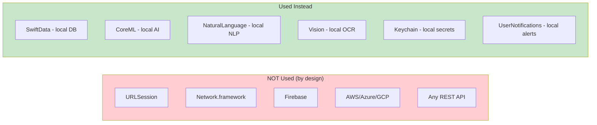
